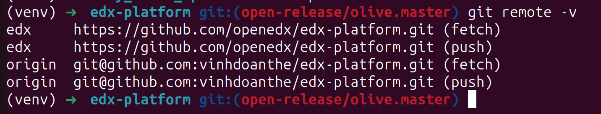

# How to upgrade Tutor and Open edX version
## Choose the version of Tutor and version of Open edX you want to upgrade to
* Go to [Tutor release history](https://pypi.org/project/tutor/#history)
* Select version, for example `16.0.2`
* Upgrade Tutor to this version by running command: `pip install "tutor[full]==16.0.2"`
* See the version of Open edX which is supported by this version of Tutor (usally writen in [Changelog](https://github.com/overhangio/tutor/blob/master/CHANGELOG.md)). For example, Tutor 16.0.2 supports Open edX Palm release

## Upgrade code of Open edX
### edx-platform (LMS and CMS)
* Go to your `edx-platform` folder which you've cloned and make modifications
* In this repo, make sure that you've added 2 remote repositories: one for your fork of `edx-platform`, and one for the original repository of `edx-platform`. Check this by the command: `git remote -v` while you are in the `edx-platform` folder

* Fetch all newest branches from edx remote by running `git fetch edx` (edx is the original remote repository of edx-platform)

* Suppose that 
  * the branch you make modifications is `feature/make-some-modifications`, and the latest branch you want to apply is `open-release/palm.master` (note that this branch has to be suported by version of Tutor you are using)

You should run following commands:
```bash
git checkout open-release/palm.master
git pull
git checkout -b feature/palm-master-make-some-modifications
# Run below command to bring your modifications to latest Open edX version
git rebase open-release/palm.master
```
* If you got conflicts, you have to resolve them
* Then run Git command to commit changes `git commit -m "Whatever you want to note"`

### Upgrade ecommerce (TBD)

## Rebuild the images
`In Progress`